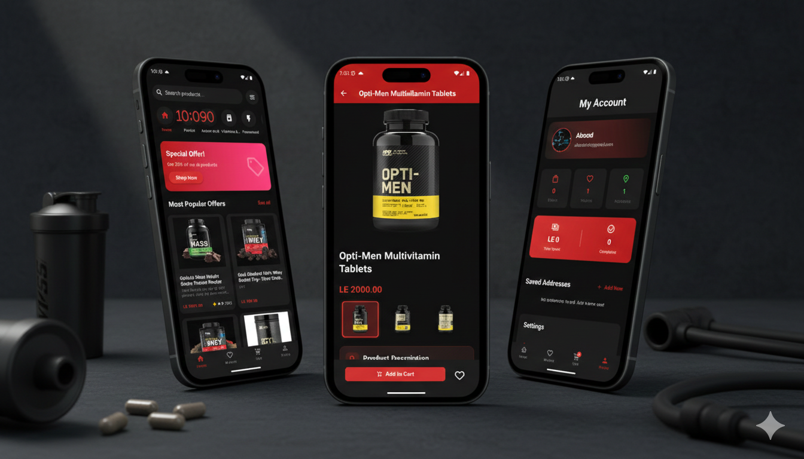
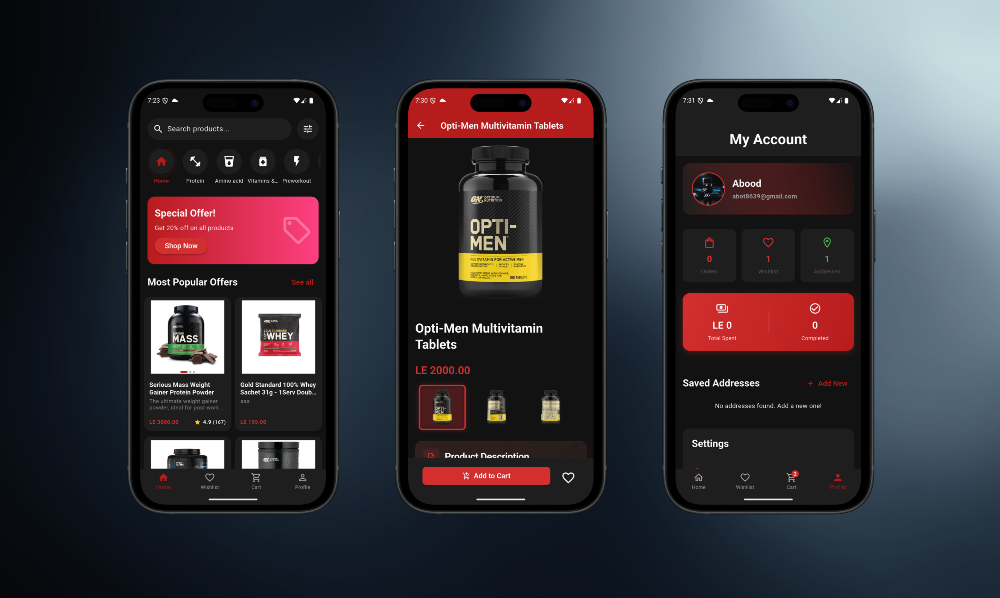
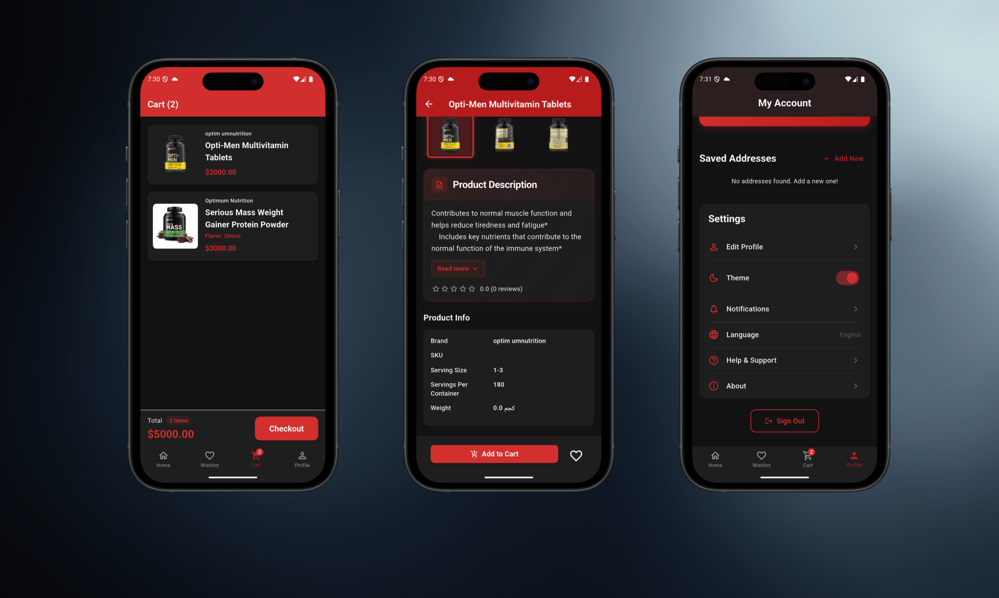
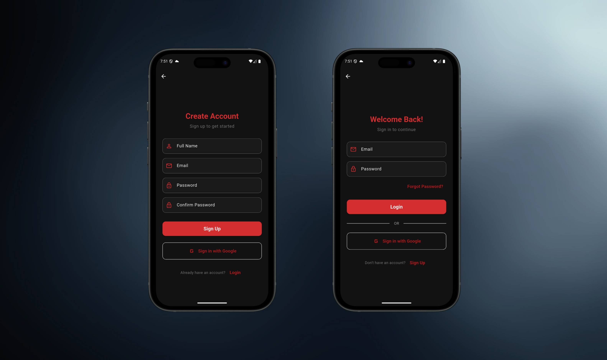

# Stronger Muscles Platform

Stronger Muscles is a professional e-commerce ecosystem dedicated to the fitness and health supplement industry. The platform is designed to provide a seamless shopping experience for consumers while offering robust management tools for administrators.

## Project Overview

This project consists of a high-performance cross-platform mobile application and a comprehensive administrative backend. It aims to bridge the gap between high-quality fitness products and enthusiasts through a secure, scalable, and user-centric digital solution.

## Demo

## Core Components

### 1. Customer Mobile Application
Built with the Flutter framework, the mobile application offers a modern, responsive user interface designed for optimal performance on both Android and iOS devices.
- State Management: Powered by GetX for reactive and efficient data flow.
- Local Storage: Implemented using Hive for offline capabilities and high-speed data retrieval.
- Map Integration: Advanced geolocation features using Google Maps for precise delivery address management.

### 2. Backend Infrastructure
The platform is powered by a RESTful API built on the Laravel framework, ensuring high security, performance, and scalability.
- Authentication: Secure user sessions managed via Laravel Sanctum, featuring integrated support for Google Social Authentication.
- Role-Based Access Control: A granular permissions system that distinguishes between standard customers and administrative users.
- Resource Management: Centralized control systems for managing products, categories, orders, and user demographics.

## Key Technical Features

- Dynamic Product Catalog: Comprehensive support for multi-category hierarchies with detailed product specifications, including flavor variations, inventory tracking, and dynamic discount management.
- Order Lifecycle Management: An end-to-end tracking system that monitors orders from initial placement through to final delivery, providing real-time status updates.
- Advanced Profile Management: Secure user profiles with integrated multi-address support and automated location-based services through the Geolocator API.
- Administrative Dashboard: A dedicated management interface allowing administrators to oversee the entire shop ecosystem, analyze sales metrics, and manage user accounts efficiently.
- Internationalization: Native support for localization to cater to a global user base.

## Technical Architecture

- Frontend: Flutter SDK, GetX, Hive, Google Maps API.
- Backend: Laravel Framework, RESTful API, MySQL/PostgreSQL.
- Cloud Services: Firebase Core, Firebase Authentication, Cloud Firestore.

## Getting Started

### Prerequisites
- Flutter SDK
- Dart SDK
- Integrated Development Environment (Android Studio or VS Code)
- PHP and Composer (required for backend administration)

### Installation Sequence
1. Clone the repository to your local environment.
2. Initialize and configure the environment variables within the .env file.
3. Execute the command "flutter pub get" to synchronize project dependencies.
4. Deploy the application to your target device using "flutter run".

## License

This project is proprietary and restricted for use within the Stronger Muscles ecosystem.
