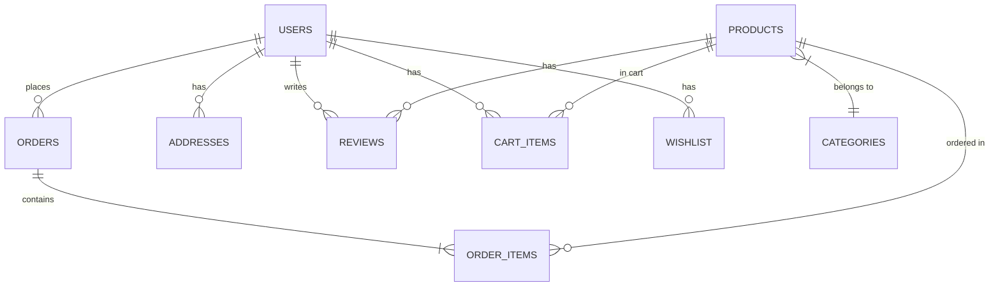

# 📊 تحليل قاعدة البيانات لتطبيق Stronger Muscles

## 🎯 نظرة عامة

هذا المستند يحتوي على تحليل شامل لبنية البيانات المستخدمة في التطبيق مع خطة لتصميم قاعدة بيانات مناسبة.

---

## 📁 تحليل البيانات الحالية

### الكيانات الرئيسية (Entities)



---

## 1️⃣ جدول المستخدمين (Users)

### الوضع الحالي:
- التطبيق يستخدم **Firebase Authentication** للمصادقة
- بيانات المستخدم تأتي من `FirebaseAuth.instance.currentUser`
- لا يوجد جدول مستخدمين محلي

### البيانات المتاحة من Firebase Auth:
| الحقل | النوع | الوصف |
|-------|------|-------|
| `uid` | String | معرف المستخدم الفريد |
| `email` | String? | البريد الإلكتروني |
| `displayName` | String? | اسم العرض |
| `photoURL` | String? | رابط الصورة الشخصية |
| `phoneNumber` | String? | رقم الهاتف |

### ⚠️ التعديلات المقترحة:
```dart
// إنشاء UserModel لتخزين بيانات إضافية
class UserModel {
  final String id;           // من Firebase uid
  final String email;
  final String? displayName;
  final String? photoUrl;
  final String? phoneNumber;
  final DateTime createdAt;
  final DateTime? lastLogin;
  final bool isActive;
  
  // حقول إضافية للتطبيق
  final String? defaultAddressId;
  final String preferredLanguage;
  final bool notificationsEnabled;
}
```

---

## 2️⃣ جدول المنتجات (Products)

### الوضع الحالي في `ProductModel`:
```dart
class ProductModel {
  final String id;
  final String name;
  final double price;
  final List<String> imageUrl;    // ⚠️ يجب تغيير الاسم لـ imageUrls
  final String description;
  final List<ReviewModel> reviews; // ⚠️ مشكلة: Reviews مضمنة في المنتج
}
```

### ⚠️ المشاكل والتعديلات المقترحة:

| المشكلة | الحل المقترح |
|---------|-------------|
| `reviews` مضمنة في المنتج | فصل Reviews في جدول منفصل |
| لا يوجد `categoryId` | إضافة حقل الفئة |
| لا يوجد `stock` (المخزون) | إضافة حقل الكمية المتاحة |
| لا يوجد `createdAt` | إضافة تاريخ الإنشاء |
| لا يوجد `discount` | إضافة نظام الخصومات |
| البيانات وهمية (hardcoded) | ربط بقاعدة بيانات حقيقية |

### الهيكل المقترح:
```dart
class ProductModel {
  final String id;
  final String name;
  final double price;
  final double? discountPrice;
  final List<String> imageUrls;
  final String description;
  final String categoryId;
  final int stockQuantity;
  final double averageRating;     // محسوب من Reviews
  final int reviewCount;          // عدد المراجعات
  final DateTime createdAt;
  final DateTime updatedAt;
  final bool isActive;
  
  // معلومات إضافية للمكملات الغذائية
  final String? brand;
  final String? servingSize;
  final int? servingsPerContainer;
  final Map<String, dynamic>? nutritionFacts;
}
```

---

## 3️⃣ جدول الفئات (Categories)

### الوضع الحالي:
- لا يوجد جدول فئات
- الفئات محددة ضمنياً في الكود: `Protein`, `Creatine`, `Amino`, `BCAA`, `PreWorkout`, `MassGainer`

### الهيكل المقترح:
```dart
class CategoryModel {
  final String id;
  final String name;
  final String? description;
  final String? imageUrl;
  final int sortOrder;
  final bool isActive;
}
```

### بيانات الفئات الموجودة:
| ID | الاسم | الوصف |
|----|------|-------|
| 1 | Protein | مساحيق البروتين |
| 2 | Creatine | مكملات الكرياتين |
| 3 | Amino | الأحماض الأمينية |
| 4 | BCAA | الأحماض الأمينية المتفرعة |
| 5 | PreWorkout | مكملات ما قبل التمرين |
| 6 | MassGainer | مكملات زيادة الوزن |

---

## 4️⃣ جدول الطلبات (Orders)

### الوضع الحالي في `OrderModel`:
```dart
@HiveType(typeId: 2)
class OrderModel extends HiveObject {
  final String id;
  final DateTime orderDate;
  final String status;           // 'pending', 'processing', 'delivered', 'cancelled'
  final List<OrderItem> items;   // ⚠️ مضمنة في الطلب
  final double totalAmount;
  final String shippingAddress;  // ⚠️ نص فقط، يجب ربطه بـ AddressModel
  final String? trackingNumber;
}
```

### ⚠️ المشاكل والتعديلات المقترحة:

| المشكلة | الحل المقترح |
|---------|-------------|
| لا يوجد `userId` | ربط الطلب بالمستخدم |
| `shippingAddress` نص فقط | استخدام `addressId` للربط |
| لا يوجد `paymentStatus` | إضافة حالة الدفع |
| لا يوجد `paymentMethod` | إضافة طريقة الدفع |
| `items` مضمنة | فصلها في جدول منفصل |

### الهيكل المقترح:
```dart
class OrderModel {
  final String id;
  final String userId;
  final DateTime orderDate;
  final String status;           // 'pending', 'processing', 'shipped', 'delivered', 'cancelled'
  final String paymentStatus;    // 'pending', 'paid', 'failed', 'refunded'
  final String paymentMethod;    // 'card', 'cash_on_delivery'
  final String addressId;        // ربط بجدول العناوين
  final double subtotal;
  final double shippingCost;
  final double discount;
  final double totalAmount;
  final String? trackingNumber;
  final String? notes;
  final DateTime createdAt;
  final DateTime updatedAt;
}
```

---

## 5️⃣ جدول عناصر الطلب (Order Items)

### الوضع الحالي في `OrderItem`:
```dart
@HiveType(typeId: 3)
class OrderItem {
  final String productId;
  final String productName;      // ⚠️ تكرار للبيانات (denormalization)
  final double price;            // ⚠️ جيد - السعر وقت الشراء
  final int quantity;
  final String imageUrl;         // ⚠️ تكرار للبيانات
}
```

### الهيكل المقترح:
```dart
class OrderItemModel {
  final String id;
  final String orderId;
  final String productId;
  final String productName;      // ✅ مهم للحفاظ على البيانات التاريخية
  final double unitPrice;        // ✅ السعر وقت الشراء
  final int quantity;
  final double subtotal;         // unitPrice * quantity
}
```

> **ملاحظة**: الاحتفاظ بـ `productName` و `unitPrice` في عناصر الطلب صحيح لأن المنتج قد يتغير اسمه أو سعره لاحقاً.

---

## 6️⃣ جدول سلة التسوق (Cart Items)

### الوضع الحالي في `CartItemModel`:
```dart
@HiveType(typeId: 0)
class CartItemModel extends HiveObject {
  final String id;
  final String name;
  final double price;
  final List<String> imageUrl;
  int quantity;
}
```

### ⚠️ المشاكل:
- لا يوجد `userId` (مفترض مستخدم واحد)
- `id` غير واضح (هل هو `cartItemId` أو `productId`؟)

### الهيكل المقترح:
```dart
class CartItemModel {
  final String id;           // معرف عنصر السلة
  final String userId;       // معرف المستخدم
  final String productId;    // معرف المنتج
  int quantity;
  final DateTime addedAt;
}
```

---

## 7️⃣ جدول العناوين (Addresses)

### الوضع الحالي في `AddressModel` ✅ (جيد):
```dart
@HiveType(typeId: 4)
class AddressModel extends HiveObject {
  final String id;
  final String label;        // 'Home', 'Work', 'Other'
  final String fullName;
  final String phoneNumber;
  final String street;
  final String city;
  final String state;
  final String postalCode;
  final String country;
  bool isDefault;
  final double? latitude;
  final double? longitude;
}
```

### ⚠️ تعديل بسيط مطلوب:
```dart
class AddressModel {
  // ... الحقول الموجودة
  final String userId;       // ⚠️ إضافة ربط بالمستخدم
  final DateTime createdAt;
  final DateTime updatedAt;
}
```

---

## 8️⃣ جدول المراجعات (Reviews)

### الوضع الحالي في `ReviewModel`:
```dart
class ReviewModel {
  final String userId;
  final String userName;
  final String comment;
  final double rating;
  final DateTime createdAt;
}
```

### ⚠️ المشاكل:
- لا يوجد `id` للمراجعة
- لا يوجد `productId` (المراجعات مضمنة في المنتج)

### الهيكل المقترح:
```dart
class ReviewModel {
  final String id;
  final String productId;    // ⚠️ إضافة
  final String userId;
  final String userName;     // ✅ للحفاظ على البيانات
  final String comment;
  final double rating;       // 1.0 - 5.0
  final DateTime createdAt;
  final DateTime? updatedAt;
  final bool isVerifiedPurchase;
}
```

---

## 9️⃣ جدول المفضلة (Wishlist)

### الوضع الحالي:
- يُخزن كـ `Box<String>` في Hive
- يحتوي فقط على `productId`

### الهيكل المقترح:
```dart
class WishlistItemModel {
  final String id;
  final String userId;
  final String productId;
  final DateTime addedAt;
}
```

---

## 🗄️ تصميم قاعدة البيانات المقترح

### خيار 1: Firebase Firestore (موصى به)

```
📦 firestore
├── 📁 users
│   └── 📄 {userId}
│       ├── email
│       ├── displayName
│       ├── photoUrl
│       ├── phoneNumber
│       ├── defaultAddressId
│       ├── createdAt
│       └── updatedAt
│
├── 📁 products
│   └── 📄 {productId}
│       ├── name
│       ├── price
│       ├── discountPrice
│       ├── imageUrls[]
│       ├── description
│       ├── categoryId
│       ├── stockQuantity
│       ├── averageRating
│       ├── reviewCount
│       └── ...
│
├── 📁 categories
│   └── 📄 {categoryId}
│       ├── name
│       ├── description
│       ├── imageUrl
│       └── sortOrder
│
├── 📁 orders
│   └── 📄 {orderId}
│       ├── userId
│       ├── orderDate
│       ├── status
│       ├── paymentStatus
│       ├── addressId
│       ├── totalAmount
│       └── 📁 items (subcollection)
│           └── 📄 {itemId}
│
├── 📁 reviews
│   └── 📄 {reviewId}
│       ├── productId
│       ├── userId
│       ├── rating
│       ├── comment
│       └── createdAt
│
├── 📁 addresses/{userId}/items
│   └── 📄 {addressId}
│
├── 📁 cart/{userId}/items
│   └── 📄 {productId}
│
└── 📁 wishlist/{userId}/items
    └── 📄 {productId}
```

### خيار 2: SQL Database (PostgreSQL/MySQL)

```sql
-- جدول المستخدمين
CREATE TABLE users (
    id VARCHAR(128) PRIMARY KEY,  -- Firebase UID
    email VARCHAR(255) UNIQUE NOT NULL,
    display_name VARCHAR(255),
    photo_url TEXT,
    phone_number VARCHAR(20),
    default_address_id VARCHAR(128),
    preferred_language VARCHAR(10) DEFAULT 'ar',
    notifications_enabled BOOLEAN DEFAULT true,
    is_active BOOLEAN DEFAULT true,
    created_at TIMESTAMP DEFAULT CURRENT_TIMESTAMP,
    updated_at TIMESTAMP DEFAULT CURRENT_TIMESTAMP
);

-- جدول الفئات
CREATE TABLE categories (
    id VARCHAR(128) PRIMARY KEY,
    name VARCHAR(255) NOT NULL,
    description TEXT,
    image_url TEXT,
    sort_order INTEGER DEFAULT 0,
    is_active BOOLEAN DEFAULT true,
    created_at TIMESTAMP DEFAULT CURRENT_TIMESTAMP
);

-- جدول المنتجات
CREATE TABLE products (
    id VARCHAR(128) PRIMARY KEY,
    name VARCHAR(255) NOT NULL,
    price DECIMAL(10, 2) NOT NULL,
    discount_price DECIMAL(10, 2),
    description TEXT,
    category_id VARCHAR(128) REFERENCES categories(id),
    stock_quantity INTEGER DEFAULT 0,
    average_rating DECIMAL(2, 1) DEFAULT 0.0,
    review_count INTEGER DEFAULT 0,
    brand VARCHAR(255),
    serving_size VARCHAR(100),
    servings_per_container INTEGER,
    is_active BOOLEAN DEFAULT true,
    created_at TIMESTAMP DEFAULT CURRENT_TIMESTAMP,
    updated_at TIMESTAMP DEFAULT CURRENT_TIMESTAMP
);

-- جدول صور المنتجات (علاقة one-to-many)
CREATE TABLE product_images (
    id VARCHAR(128) PRIMARY KEY,
    product_id VARCHAR(128) REFERENCES products(id) ON DELETE CASCADE,
    image_url TEXT NOT NULL,
    sort_order INTEGER DEFAULT 0,
    created_at TIMESTAMP DEFAULT CURRENT_TIMESTAMP
);

-- جدول العناوين
CREATE TABLE addresses (
    id VARCHAR(128) PRIMARY KEY,
    user_id VARCHAR(128) REFERENCES users(id) ON DELETE CASCADE,
    label VARCHAR(50) NOT NULL,  -- 'Home', 'Work', 'Other'
    full_name VARCHAR(255) NOT NULL,
    phone_number VARCHAR(20) NOT NULL,
    street TEXT NOT NULL,
    city VARCHAR(100) NOT NULL,
    state VARCHAR(100) NOT NULL,
    postal_code VARCHAR(20),
    country VARCHAR(100) NOT NULL,
    is_default BOOLEAN DEFAULT false,
    latitude DECIMAL(10, 8),
    longitude DECIMAL(11, 8),
    created_at TIMESTAMP DEFAULT CURRENT_TIMESTAMP,
    updated_at TIMESTAMP DEFAULT CURRENT_TIMESTAMP
);

-- جدول الطلبات
CREATE TABLE orders (
    id VARCHAR(128) PRIMARY KEY,
    user_id VARCHAR(128) REFERENCES users(id),
    address_id VARCHAR(128) REFERENCES addresses(id),
    order_date TIMESTAMP DEFAULT CURRENT_TIMESTAMP,
    status VARCHAR(50) DEFAULT 'pending',  -- pending, processing, shipped, delivered, cancelled
    payment_status VARCHAR(50) DEFAULT 'pending',  -- pending, paid, failed, refunded
    payment_method VARCHAR(50),  -- card, cash_on_delivery
    subtotal DECIMAL(10, 2) NOT NULL,
    shipping_cost DECIMAL(10, 2) DEFAULT 0,
    discount DECIMAL(10, 2) DEFAULT 0,
    total_amount DECIMAL(10, 2) NOT NULL,
    tracking_number VARCHAR(100),
    notes TEXT,
    created_at TIMESTAMP DEFAULT CURRENT_TIMESTAMP,
    updated_at TIMESTAMP DEFAULT CURRENT_TIMESTAMP
);

-- جدول عناصر الطلب
CREATE TABLE order_items (
    id VARCHAR(128) PRIMARY KEY,
    order_id VARCHAR(128) REFERENCES orders(id) ON DELETE CASCADE,
    product_id VARCHAR(128) REFERENCES products(id),
    product_name VARCHAR(255) NOT NULL,  -- Snapshot
    unit_price DECIMAL(10, 2) NOT NULL,  -- Snapshot
    quantity INTEGER NOT NULL,
    subtotal DECIMAL(10, 2) NOT NULL,
    created_at TIMESTAMP DEFAULT CURRENT_TIMESTAMP
);

-- جدول المراجعات
CREATE TABLE reviews (
    id VARCHAR(128) PRIMARY KEY,
    product_id VARCHAR(128) REFERENCES products(id) ON DELETE CASCADE,
    user_id VARCHAR(128) REFERENCES users(id),
    user_name VARCHAR(255) NOT NULL,  -- Snapshot
    rating DECIMAL(2, 1) NOT NULL CHECK (rating >= 1 AND rating <= 5),
    comment TEXT,
    is_verified_purchase BOOLEAN DEFAULT false,
    created_at TIMESTAMP DEFAULT CURRENT_TIMESTAMP,
    updated_at TIMESTAMP
);

-- جدول سلة التسوق
CREATE TABLE cart_items (
    id VARCHAR(128) PRIMARY KEY,
    user_id VARCHAR(128) REFERENCES users(id) ON DELETE CASCADE,
    product_id VARCHAR(128) REFERENCES products(id) ON DELETE CASCADE,
    quantity INTEGER NOT NULL DEFAULT 1,
    added_at TIMESTAMP DEFAULT CURRENT_TIMESTAMP,
    UNIQUE(user_id, product_id)
);

-- جدول المفضلة
CREATE TABLE wishlist_items (
    id VARCHAR(128) PRIMARY KEY,
    user_id VARCHAR(128) REFERENCES users(id) ON DELETE CASCADE,
    product_id VARCHAR(128) REFERENCES products(id) ON DELETE CASCADE,
    added_at TIMESTAMP DEFAULT CURRENT_TIMESTAMP,
    UNIQUE(user_id, product_id)
);

-- Indexes للأداء
CREATE INDEX idx_products_category ON products(category_id);
CREATE INDEX idx_orders_user ON orders(user_id);
CREATE INDEX idx_orders_status ON orders(status);
CREATE INDEX idx_reviews_product ON reviews(product_id);
CREATE INDEX idx_cart_user ON cart_items(user_id);
CREATE INDEX idx_wishlist_user ON wishlist_items(user_id);
```

---

## 📝 ملخص التعديلات المطلوبة

### تعديلات عاجلة (High Priority):

| الملف | التعديل |
|-------|---------|
| `ProductModel` | إزالة `reviews`، إضافة `categoryId`, `stockQuantity`, `averageRating` |
| `OrderModel` | إضافة `userId`, `paymentStatus`, `paymentMethod` |
| `CartItemModel` | إضافة `userId`, تغيير `id` إلى `productId` |
| `AddressModel` | إضافة `userId` |
| `ReviewModel` | إضافة `id`, `productId` |

### تعديلات متوسطة الأولوية:

| التعديل | الوصف |
|---------|-------|
| إنشاء `CategoryModel` | جدول جديد للفئات |
| إنشاء `UserModel` | لتخزين بيانات المستخدم الإضافية |
| فصل `OrderItem` | جعلها مستقلة بـ `orderId` |

### إعادة هيكلة الـ Repositories:

1. **ProductRepository**: استبدال البيانات الوهمية بـ Firestore/API
2. **OrderRepository**: إضافة CRUD كاملة
3. **إنشاء Repositories جديدة**:
   - `UserRepository`
   - `CategoryRepository`
   - `ReviewRepository`
   - `AddressRepository`
   - `CartRepository`
   - `WishlistRepository`

---

## 🔄 خطة الترحيل (Migration Plan)

### المرحلة 1: إعداد قاعدة البيانات
1. إنشاء المجموعات/الجداول في Firebase Firestore
2. إعداد قواعد الأمان (Security Rules)

### المرحلة 2: تحديث النماذج
1. تحديث `ProductModel` مع الحقول الجديدة
2. إنشاء `CategoryModel`
3. تحديث `OrderModel` و `ReviewModel`

### المرحلة 3: تحديث الـ Repositories
1. إنشاء `FirebaseProductRepository`
2. ترحيل البيانات الوهمية إلى Firestore
3. تحديث الـ Controllers

### المرحلة 4: التخزين المحلي
- الإبقاء على Hive للـ Cache والحفظ المؤقت
- مزامنة البيانات مع Firestore

---

## ✅ التوصيات النهائية

1. **استخدم Firebase Firestore** لأنك تستخدم Firebase Auth بالفعل
2. **أبقِ على Hive** للتخزين المؤقت (cache) وتجربة offline
3. **فصل Reviews عن Products** للمرونة والأداء
4. **إضافة userId** لجميع البيانات المرتبطة بالمستخدم
5. **إنشاء جدول Categories** منفصل
6. **تطبيق Denormalization بحذر** - احتفظ بنسخ من البيانات التاريخية في الطلبات
